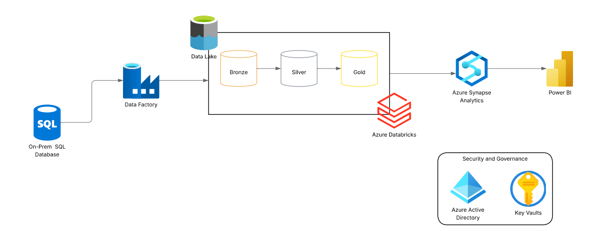
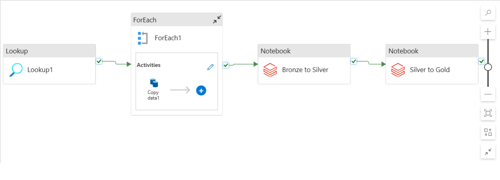
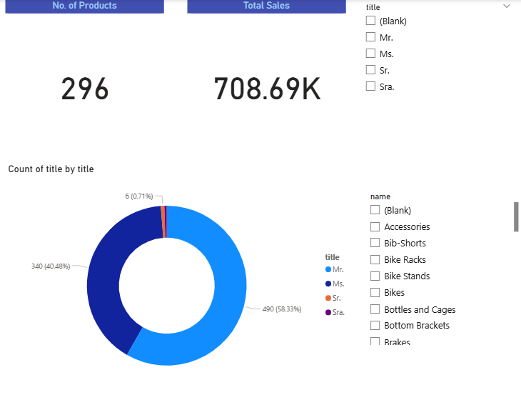

# ☁️ Azure End-to-End Data Engineering Real-Time Project

Building an automated Azure data pipeline to move, transform, and expose customer and sales data through Synapse views, with orchestration via ADF and transformations in Databricks.

---

## 📌 Table of Contents

- [Project Architecture](#project-architecture)
- [Overview](#overview)
- [Business Requirements](#business-requirements)
- [Solution Overview](#solution-overview)
- [Technology Stack](#technology-stack)
- [Project Structure](#project-structure)
- [Data Ingestion](#data-ingestion)
- [Data Transformation](#data-transformation)
- [Data Loading & Reporting](#data-loading--reporting)
- [Automation & Monitoring](#automation--monitoring)
- [Security & Governance](#security--governance)
- [How to Run This Project](#how-to-run-this-project)
- [Conclusion](#conclusion)
- [Author & Contact](#author--contact)

---

## Project Architecture



This diagram provides a high-level overview of the end-to-end Azure data engineering workflow: from ingestion of on-prem SQL Server tables into ADLS, transformation via Databricks notebooks (bronze → silver → gold), and exposure through Synapse serverless views for analytics and Power BI dashboards.

---

## Overview

This project demonstrates a real-time data engineering pipeline on Microsoft Azure. Data is ingested from an on-prem SQL Server, copied into Azure Data Lake, transformed via Databricks notebooks, exposed through Synapse serverless views, and orchestrated end-to-end with Azure Data Factory (ADF).

---

## Business Requirements

- Automate daily ingestion of customer and sales tables from SQL Server to Azure.  
- Store data in a secure data lake (Parquet/Delta format).  
- Create serverless views in Synapse dynamically for analytics.  
- Enable scalable reporting and downstream Power BI integration.

---

## Solution Overview

- **Data Ingestion:** Copy activity pipeline extracts all source tables into ADLS.  
- **Transformation:** Databricks notebooks handle raw-to-curated data transformation.  
- **Synapse Layer:** Stored procedure (`CreateSQLServerlessView_gold`) dynamically generates views for each ingested table.  
- **Orchestration:** Pipelines are scheduled with triggers for daily refresh.

---

## Technology Stack

- **Azure Data Factory (ADF)** – Orchestration & Pipelines  
- **Azure Data Lake Storage (ADLS)** – Centralized storage (Parquet/Delta)  
- **Azure Databricks** – Data processing & transformations  
- **Azure Synapse Analytics (Serverless)** – Views for querying  
- **Azure Key Vault** – Secure secret management  
- **On-Prem SQL Server** – Source system  
- **Power BI** – Analytics & Reporting

---

## Project Structure

```text
azure-end-to-end-data-engineering/
│
├── README.md
├── requirements.txt
│
├── images/
│   ├── dashboard.png
│   ├── datafactory.png
│   └── lucidchart_workflow.png
│
├── docs/
│   ├── Azure E2E Data Engineering Real Time Project Demo - Business Req.docx
│   └── Azure E2E Data Engineering Real Time Project Demo - Notes.docx
│
├── notebooks/                   # Databricks notebooks
│   ├── bronze_ingestion.ipynb
│   ├── silver_transformation.ipynb
│   └── gold_aggregation.ipynb
│
├── datafactory/
│   ├── dataset/
│   │   ├── ParquetSink.json
│   │   └── SqlServerTable1.json
│   │
│   ├── linkedService/
│   │   ├── AzureDatabricksLinkedService.json
│   │   ├── AzureDataLakeStorageLinkedService.json
│   │   ├── AzureKeyVault1.json
│   │   └── SqlServerOnPremLinkedService.json
│   │
│   ├── pipeline/
│   │   └── copy_all_tables.json
│   │
│   └── trigger/
│       └── daily_trigger_2.json
│
├── synapse/
│   └── sp_CreateSQLServerlessView_gold.sql
│
└── dashboard.pbix                 # Power BI file
```

<a class="anchor" id="data-ingestion"></a>Data Ingestion

ADF pipeline (copy_all_tables.json) ingests multiple SQL Server tables into ADLS.

Datasets define:

Source → SqlServerTable1.json

Sink → ParquetSink.json

Data is stored in Parquet format for efficient querying.



<a class="anchor" id="data-transformation"></a>Data Transformation

Databricks notebooks:

bronze_ingestion.ipynb – Raw ingestion

silver_transformation.ipynb – Cleaning & filtering

gold_aggregation.ipynb – Aggregations & business metrics

Synapse serverless views provide a lightweight transformation layer for analytics.

<a class="anchor" id="data-loading--reporting"></a>Data Loading & Reporting

Stored procedure CreateSQLServerlessView_gold dynamically generates Synapse views per ingested table.

Example Usage:

EXEC CreateSQLServerlessView_gold @ViewName = 'Customer';


These views are ready for Power BI dashboards or other reporting tools.

<a class="anchor" id="automation--monitoring"></a>Automation & Monitoring

ADF trigger (daily_trigger_2.json) runs pipelines daily.

Monitoring is performed via:

ADF pipeline activity logs

Synapse query execution metrics

<a class="anchor" id="security--governance"></a>Security & Governance

Azure Key Vault secures secrets and connection strings.

Role-Based Access Control (RBAC) ensures permissions across Azure services.



<a class="anchor" id="how-to-run-this-project"></a>How to Run This Project

Clone repository:

git clone https://github.com/yourusername/azure-end-to-end-data-engineering.git


Install dependencies:

pip install -r requirements.txt


Import ADF assets (/pipelines/) into Azure Data Factory.

Deploy Synapse stored procedure:

/synapse/sp_CreateSQLServerlessView_gold.sql


Configure Linked Services (Azure subscription, storage, SQL credentials).

Enable daily_trigger_2.json to schedule pipeline execution.

Validate Synapse views:

EXEC CreateSQLServerlessView_gold @ViewName = 'SalesOrder';

<a class="anchor" id="conclusion"></a>Conclusion

This project demonstrates an end-to-end Azure data pipeline covering ingestion, orchestration, Databricks transformations, Synapse view creation, and automated monitoring. It provides a scalable foundation for enterprise analytics, ready for Power BI integration.

<a class="anchor" id="author--contact"></a>Author & Contact

Raj Aryan
Data Engineer | Aspiring Product Manager

📧 Email: rajryanwork@gmail.com

🔗 LinkedIn: https://www.linkedin.com/in/raj-aryan-86005226b/